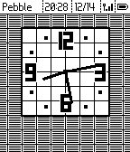
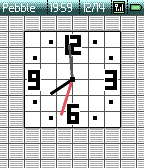
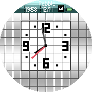
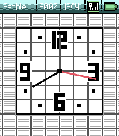

# nds-pebble

Aplite, Diorite, and Flint: 

Basalt: 

Chalk: 

Emery: 

A recreation of the NDS BIOS clock.

Uses the Simple Analog example as a base https://github.com/pebble-examples/simple-analog 
